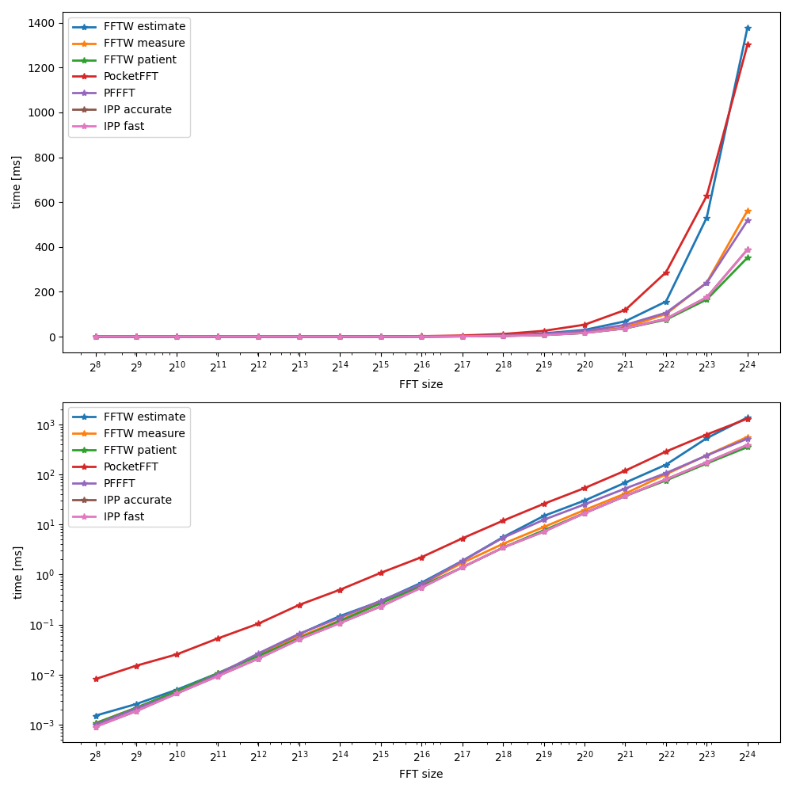

# FFT benchmarks
- [FFTW](https://www.fftw.org/) with [FFTW_ESTIMATE](https://www.fftw.org/fftw3_doc/Planner-Flags.html)
- [FFTW](https://www.fftw.org/) with [FFTW_MEASURE](https://www.fftw.org/fftw3_doc/Planner-Flags.html)
- [FFTW](https://www.fftw.org/) with [FFTW_PATIENT](https://www.fftw.org/fftw3_doc/Planner-Flags.html)
- [PocketFFT](https://gitlab.mpcdf.mpg.de/mtr/pocketfft/tree/cpp)
- [PFFFT](https://github.com/marton78/pffft)
- [KFR](https://www.kfrlib.com/newdocs/)
- [OpenCV](https://www.intel.com/content/www/us/en/developer/articles/technical/enabling-ipp-on-opencv-windows-and-ubuntu.html)
- [IPP](https://www.intel.com/content/www/us/en/developer/tools/oneapi/ipp.html#gs.9bfftl) with ippAlgHintAccurate
- [IPP](https://www.intel.com/content/www/us/en/developer/tools/oneapi/ipp.html#gs.9bfftl) with ippAlgHintFast

  

